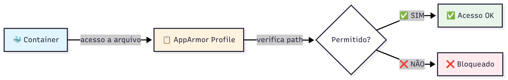
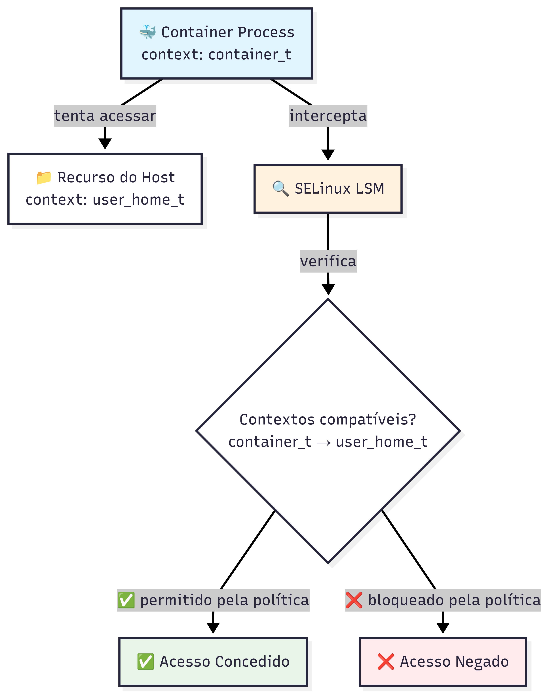

# 🔐 Capabilities, Seccomp e AppArmor/SELinux no Docker

## 📋 Índice

1. [Linux Capabilities](#-linux-capabilities)
2. [Seccomp (Secure Computing)](#️-seccomp-secure-computing)
3. [AppArmor e SELinux](#-apparmor-e-selinux)
4. [Configurações de Segurança Práticas](#️-configurações-de-segurança-práticas)
5. [Exemplos usando capabilities, seccomp, apparmor e selinux](#-exemplos-usando-capabilities-seccomp-apparmor-e-selinux)
6. [Comparação entre Tecnologias de Segurança](#-comparação-entre-tecnologias-de-segurança)
7. [Checklist de Segurança](#-checklist-de-segurança)

---

## 🔑 Linux Capabilities

### O que são Capabilities?

Capabilities são uma forma de dividir os privilégios de root em unidades menores e específicas. Ao invés de dar todos os poderes do root, você pode dar apenas os necessários.

### Listar todas as capabilities disponíveis:

```bash
# Ver todas as capabilities do sistema
docker run --rm alpine sh -c "apk add -q libcap && capsh --print"
```

### Capabilities mais comuns no Docker:

| Capability             | Descrição                     | Uso comum                              |
| ---------------------- | ----------------------------- | -------------------------------------- |
| `CAP_NET_BIND_SERVICE` | Bind em portas < 1024         | Servidores web (nginx, apache)         |
| `CAP_CHOWN`            | Mudar ownership de arquivos   | Instalação de pacotes, setup inicial   |
| `CAP_SETUID`           | Mudar UID do processo         | Aplicações que trocam de usuário       |
| `CAP_SETGID`           | Mudar GID do processo         | Aplicações que trocam de grupo         |
| `CAP_DAC_OVERRIDE`     | Ignorar permissões de arquivo | **PERIGOSO** - evitar                  |
| `CAP_SYS_ADMIN`        | Quase tudo                    | **MUITO PERIGOSO** - praticamente root |
| `CAP_NET_ADMIN`        | Configurar rede               | Containers de rede (VPN, proxy)        |
| `CAP_SYS_PTRACE`       | Debug de processos            | Ferramentas de debug                   |

### Capabilities padrão do Docker:

```bash
# Ver capabilities padrão usando o /proc/<id>/status
docker run --rm alpine sh -c "cat /proc/1/status | grep Cap"

# Resultado (representa as capabilities do container em hexadecimal)
# CapInh: 0000000000000000
# CapPrm: 00000000a80425fb
# CapEff: 00000000a80425fb
# CapBnd: 00000000a80425fb
# CapAmb: 0000000000000000


# Ver capabilities padrão usando capsh
docker run --rm alpine sh -c "apk add -q libcap && capsh --print"

# Resultado
# Current: cap_chown,cap_dac_override,cap_fowner,cap_fsetid,cap_kill,cap_setgid,cap_setuid,cap_setpcap,cap_net_bind_service,cap_net_raw,cap_sys_chroot,cap_mknod,cap_audit_write,cap_setfcap=ep
# Bounding set =cap_chown,cap_dac_override,cap_fowner,cap_fsetid,cap_kill,cap_setgid,cap_setuid,# cap_setpcap,cap_net_bind_service,cap_net_raw,cap_sys_chroot,cap_mknod,cap_audit_write,cap_setfcap
```

### Container privilegiado (--privileged):

```bash
# PERIGOSO: Tem TODAS as capabilities
docker run --rm --privileged alpine sh -c "cat /proc/1/status | grep Cap"

# Resultado
# Current: =ep (significa que todas as capabilities em bounding set estão ativas e efetivas)
# Bounding set lista todas as capabilities do kernel, todas ativas
# Com o --privileged, o root do container tem os mesmos poderes que o root da máquina host
```

### Exemplo prático - Servidor web seguro:

```bash
# Remover TODAS capabilities e adicionar capabilities necessárias para rodar nginx
docker run --rm \
        --cap-drop=ALL \
        --cap-add=CAP_CHOWN \
        --cap-add=CAP_SETGID \
        --cap-add=CAP_SETUID \
        -p 80:80 \
        nginx

# Verificar capabilities do container
docker exec <container-id> cat /proc/1/status | grep Cap

# Resultado (bem diferente do resultado acima)
# CapInh: 0000000000000000
# CapPrm: 00000000000000c1
# CapEff: 00000000000000c1
# CapBnd: 00000000000000c1
# CapAmb: 0000000000000000

```

---

## 🛡️ Seccomp (Secure Computing)

### O que é Seccomp?

Seccomp filtra chamadas de sistema (syscalls) que um container pode fazer. O kernel Linux tem ~400 syscalls, mas a maioria das aplicações usa apenas algumas dezenas.
Veja mais detalhes: [https://docs.docker.com/engine/security/seccomp/](https://docs.docker.com/engine/security/seccomp/)

### Perfil padrão do Docker:

```bash
# Docker bloqueia ~60 syscalls perigosas por padrão
# Ver status do seccomp
docker run --rm alpine grep Seccomp /proc/1/status

# Resultado
# Seccomp: 2
# Seccomp_filters: 3

# Seccomp:
# 0 → Seccomp desabilitado (sem filtro).
# 1 → Seccomp em modo "strict" (quase nunca usado hoje em dia, só permite read, write, _exit, sigreturn).
# 2 → Seccomp em modo filter → ou seja, o kernel está aplicando regras de filtragem de syscalls com base em um BPF (Berkeley Packet Filter).
# No caso do Docker, esse é o modo padrão: ele aplica o profile default que bloqueia syscalls perigosas como keyctl, mount, etc.

# Seccomp_filters:
# Esse valor indica quantos filtros de seccomp foram anexados ao processo.
# Cada filtro é uma regra BPF que define quais syscalls são permitidas, bloqueadas ou auditadas.
# No container que você rodou, existem 3 filtros ativos aplicados ao processo PID 1.
# Isso geralmente inclui o filtro padrão do Docker + filtros herdados de libs ou runtime.

# Comparar com seccomp desabilitado (PERIGOSO)
docker run --rm --security-opt seccomp=unconfined alpine grep Seccomp /proc/1/status

# Resultado
# Seccomp: 2
# Seccomp_filters: 2
# Veja que agora tem um filtro a menos aplicado, o que significa que algumas syscalls estão menos protegidas. Se este valor diminuir ou chegar a zero, o container estará ainda mais vulnerável a ataques.
```

### Modo Unconfined - Seccomp Desabilitado

O modo `unconfined` desabilita todas as proteções seccomp, permitindo que o container execute qualquer syscall disponível no kernel. Isso remove uma camada importante de segurança.

#### **⚠️ Quando usar seccomp=unconfined (casos específicos):**

| Cenário | Motivo | Exemplo |
|---------|--------|---------|
| **Debugging/Desenvolvimento** | Eliminar variável seccomp para diagnosticar problemas | Identificar syscalls bloqueadas |
| **Ferramentas de sistema** | Precisam de syscalls avançadas | `strace`, `gdb`, ferramentas de monitoramento |
| **Aplicações legadas** | Usam syscalls antigas/depreciadas | Software muito antigo sem suporte |
| **Containers privilegiados** | Já rodam com `--privileged` | Casos onde o seccomp é redundante |

#### **Exemplos práticos - Debug com unconfined:**

```bash
# 1. PROBLEMA: Container falhando por seccomp
docker run --rm alpine strace ls
# Erro: ptrace: Operation not permitted

# 2. SOLUÇÃO TEMPORÁRIA: Usar unconfined para debug
docker run --rm \
  --security-opt seccomp=unconfined \
  alpine sh -c "apk add --no-cache strace && strace ls /"

# Resultado: funciona, mas SEM proteção seccomp

# 3. SOLUÇÃO CORRETA: Adicionar capability específica
docker run --rm \
  --cap-add SYS_PTRACE \
  alpine sh -c "apk add --no-cache strace && strace ls /"
# Resultado: funciona COM proteção seccomp mantida
```

#### **Comparativo: Default vs Unconfined vs Personalizado**

```bash
# Teste de syscalls perigosas
cat > test-syscalls.sh << 'EOF'
#!/bin/sh
echo "=== Teste de Syscalls Perigosas ==="

# Teste 1: mount (perigosa - deve falhar com seccomp)
echo -n "Mount: "
mount -t tmpfs tmpfs /mnt 2>/dev/null && echo "PERMITIDO ⚠️" || echo "BLOQUEADO ✓"

# Teste 2: reboot (perigosa - deve falhar com seccomp)  
echo -n "Reboot: "
reboot 2>/dev/null && echo "PERMITIDO ⚠️" || echo "BLOQUEADO ✓"

# Teste 3: keyctl (perigosa - deve falhar com seccomp)
echo -n "Keyctl: "
keyctl show 2>/dev/null && echo "PERMITIDO ⚠️" || echo "BLOQUEADO ✓"

# Teste 4: Ver status do seccomp
echo -n "Status Seccomp: "
grep "Seccomp:" /proc/1/status
EOF

echo "=== Container com Seccomp PADRÃO (seguro) ==="
docker run --rm -v $PWD/test-syscalls.sh:/test.sh:ro alpine sh /test.sh

echo -e "\n=== Container com Seccomp UNCONFINED (inseguro) ==="
docker run --rm \
  --security-opt seccomp=unconfined \
  -v $PWD/test-syscalls.sh:/test.sh:ro \
  alpine sh /test.sh

echo -e "\n=== Container com Seccomp PERSONALIZADO (mais restritivo) ==="
# Usando o perfil ultra-restritivo criado anteriormente
docker run --rm \
  --security-opt seccomp=ultra-restritivo.json \
  -v $PWD/test-syscalls.sh:/test.sh:ro \
  alpine sh /test.sh
```

#### **Análise dos resultados:**

| Modo | Mount | Reboot | Keyctl | Seccomp Status | Segurança |
|------|-------|--------|--------|----------------|-----------|
| **Padrão** | ❌ Bloqueado | ❌ Bloqueado | ❌ Bloqueado | `Seccomp: 2` | ✅ **Seguro** |
| **Unconfined** | ✅ Permitido | ✅ Permitido | ✅ Permitido | `Seccomp: 0` | ❌ **Perigoso** |
| **Personalizado** | ❌ Bloqueado | ❌ Bloqueado | ❌ Bloqueado | `Seccomp: 2` | ✅ **Muito seguro** |

#### **Casos reais onde unconfined pode ser necessário:**

```bash
# 1. Ferramentas de debugging avançado
docker run --rm -it \
  --security-opt seccomp=unconfined \
  --cap-add SYS_PTRACE \
  --cap-add SYS_ADMIN \
  ubuntu:latest bash

# Dentro do container - ferramentas que precisam de muitas syscalls:
# apt update && apt install -y ltrace strace gdb
# ltrace ls    # Rastrear chamadas de biblioteca
# strace ls    # Rastrear syscalls
# gdb --args ls /  # Debug completo

# 2. Aplicação legacy que usa syscalls depreciadas
docker run --rm \
  --security-opt seccomp=unconfined \
  --user root \
  old-legacy-app:1.0

# 3. Container para análise de segurança
docker run --rm -it \
  --security-opt seccomp=unconfined \
  --cap-add SYS_ADMIN \
  --cap-add SYS_PTRACE \
  -v /:/host:ro \
  security-scanner:latest
```

#### **❌ Maus exemplos - NÃO fazer em produção:**

```bash
# ERRADO: Usar unconfined "por preguiça"
# docker run --security-opt seccomp=unconfined myapp
# Motivo: Remove proteção desnecessariamente

# ERRADO: Usar unconfined para "resolver" problemas
# docker run --security-opt seccomp=unconfined problematic-app
# Motivo: Mascara problemas reais da aplicação

# ERRADO: Usar unconfined por padrão
# docker-compose.yml:
# security_opt:
#   - seccomp=unconfined
# Motivo: Expõe todos os containers desnecessariamente
```

#### **✅ Alternativas seguras ao unconfined:**

```bash
# CERTO: Identificar syscalls necessárias e criar perfil personalizado
# 1. Debug com unconfined temporariamente
docker run --rm \
  --security-opt seccomp=unconfined \
  --name debug-app \
  myapp

# 2. Em outro terminal, capturar syscalls usadas
docker exec debug-app sh -c "apk add strace && strace -c mycommand"

# 3. Criar perfil permitindo apenas syscalls necessárias
# (usar exemplo de perfil personalizado da seção anterior)

# 4. Aplicar perfil personalizado
docker run --rm \
  --security-opt seccomp=custom-profile.json \
  myapp
```

#### **Monitoramento de containers unconfined:**

```bash
# 1. Identificar containers rodando sem seccomp
docker ps --format "table {{.Names}}\t{{.Image}}" | while read name image; do
  if [ "$name" != "NAMES" ]; then
    profile=$(docker inspect $name --format='{{.HostConfig.SecurityOpt}}' 2>/dev/null)
    if echo "$profile" | grep -q "unconfined"; then
      echo "⚠️  Container $name está rodando SEM seccomp (unconfined)"
    fi
  fi
done

# 2. Verificar via docker inspect
docker inspect container-name | jq '.[0].HostConfig.SecurityOpt'
# Se retornar ["seccomp=unconfined"] = sem proteção

# 3. Auditoria completa
docker ps --format "{{.Names}}" | xargs -I {} sh -c 'echo "Container: {}"; docker inspect {} | jq ".[0].HostConfig.SecurityOpt"; echo'
```

#### **Política de uso recomendada:**

```yaml
# .security-policy.yml
seccomp_policy:
  production:
    default: "enabled"  # Sempre usar perfil padrão ou personalizado
    unconfined: "forbidden"  # NUNCA usar unconfined
    
  staging:
    default: "enabled"
    unconfined: "approval_required"  # Apenas com aprovação
    
  development:
    default: "enabled" 
    unconfined: "temporary_only"  # Apenas para debug temporário
    max_duration: "1hour"  # Máximo 1 hora em unconfined
```

### Criar perfil Seccomp customizado:

#### Estrutura do perfil Seccomp explicada:

```json
{
  "defaultAction": "SCMP_ACT_ERRNO",
  "architectures": ["SCMP_ARCH_X86_64", "SCMP_ARCH_X86"],
  "syscalls": [
    {
      "names": [...],
      "action": "SCMP_ACT_ALLOW"
    }
  ]
}
```

**Componentes do perfil:**

| Campo           | Descrição                              | Valores possíveis                                                                        |
| --------------- | -------------------------------------- | ---------------------------------------------------------------------------------------- |
| `defaultAction` | Ação padrão para syscalls não listadas | `SCMP_ACT_ERRNO` (bloqueia), `SCMP_ACT_ALLOW` (permite), `SCMP_ACT_KILL` (mata processo) |
| `architectures` | Arquiteturas suportadas                | `SCMP_ARCH_X86_64`, `SCMP_ARCH_X86`, `SCMP_ARCH_ARM64`                                   |
| `syscalls`      | Lista de syscalls e suas ações         | Array de objetos com `names` e `action`                                                  |

#### Syscalls essenciais explicadas:

```json
{
  "defaultAction": "SCMP_ACT_ERRNO", // Bloqueia tudo por padrão
  "architectures": ["SCMP_ARCH_X86_64", "SCMP_ARCH_X86"],
  "syscalls": [
    {
      "names": [
        // === SYSCALLS DE I/O BÁSICO ===
        "read", // Ler dados de arquivo/socket
        "write", // Escrever dados em arquivo/socket
        "open", // Abrir arquivo
        "close", // Fechar arquivo
        "stat", // Obter informações de arquivo
        "fstat", // Obter info de arquivo por descriptor

        // === GERENCIAMENTO DE MEMÓRIA ===
        "mmap", // Mapear memória
        "mprotect", // Mudar proteção de memória
        "munmap", // Desmapear memória
        "brk", // Ajustar tamanho do heap

        // === SINAIS E PROCESSOS ===
        "rt_sigaction", // Definir handlers de sinais
        "rt_sigprocmask", // Bloquear/desbloquear sinais
        "clone", // Criar threads/processos
        "fork", // Criar processo filho
        "execve", // Executar programa
        "exit", // Terminar processo
        "exit_group", // Terminar todos threads
        "wait4", // Esperar processo filho
        "kill", // Enviar sinal

        // === REDE ===
        "socket", // Criar socket
        "connect", // Conectar a servidor
        "accept", // Aceitar conexão
        "bind", // Associar endereço ao socket
        "listen", // Escutar conexões
        "sendto", // Enviar dados
        "recvfrom", // Receber dados

        // === SISTEMA DE ARQUIVOS ===
        "getcwd", // Obter diretório atual
        "chdir", // Mudar diretório
        "mkdir", // Criar diretório
        "rmdir", // Remover diretório
        "rename", // Renomear arquivo
        "unlink", // Deletar arquivo
        "chmod", // Mudar permissões
        "chown", // Mudar dono

        // === INFORMAÇÕES DO SISTEMA ===
        "getuid", // Obter user ID
        "getgid", // Obter group ID
        "getpid", // Obter process ID
        "gettimeofday", // Obter tempo atual
        "uname", // Info do sistema

        // === SINCRONIZAÇÃO ===
        "futex", // Fast userspace mutex
        "nanosleep", // Dormir com precisão

        // === I/O AVANÇADO ===
        "epoll_create", // Criar epoll
        "epoll_wait", // Esperar eventos
        "epoll_ctl", // Controlar epoll
        "select", // Multiplexar I/O
        "poll" // Verificar I/O
      ],
      "action": "SCMP_ACT_ALLOW" // Permite estas syscalls
    }
  ]
}
```

#### Syscalls perigosas (NÃO incluir):

| Syscall         | Por que é perigosa                     |
| --------------- | -------------------------------------- |
| `mount`         | Pode montar filesystems, expor host    |
| `umount`        | Pode desmontar filesystems críticos    |
| `ptrace`        | Debug de processos, leitura de memória |
| `setns`         | Mudar namespaces, escape de container  |
| `unshare`       | Criar novos namespaces                 |
| `pivot_root`    | Mudar root filesystem                  |
| `chroot`        | Mudar root, possível escape            |
| `reboot`        | Reiniciar sistema                      |
| `kexec_load`    | Carregar novo kernel                   |
| `init_module`   | Carregar módulos do kernel             |
| `delete_module` | Remover módulos do kernel              |
| `iopl`          | Acesso direto a I/O                    |
| `ioperm`        | Permissões de I/O                      |
| `swapon`        | Ativar swap                            |
| `swapoff`       | Desativar swap                         |

### Perfil Seccomp para aplicação web (exemplo real):

```json
{
  "defaultAction": "SCMP_ACT_ERRNO",
  "architectures": ["SCMP_ARCH_X86_64"],
  "syscalls": [
    {
      "names": [
        // I/O básico
        "read",
        "write",
        "open",
        "openat",
        "close",
        "stat",
        "fstat",
        "lstat",
        "poll",
        "lseek",
        "ioctl",
        "fcntl",
        "flock",
        "fsync",

        // Memória
        "mmap",
        "mprotect",
        "munmap",
        "brk",
        "mremap",
        "msync",
        "mincore",
        "madvise",

        // Processos e threads
        "rt_sigaction",
        "rt_sigprocmask",
        "rt_sigreturn",
        "getpid",
        "gettid",
        "tgkill",
        "sigaltstack",
        "prctl",
        "arch_prctl",
        "clone",
        "futex",
        "set_tid_address",
        "exit_group",

        // Rede (servidor web)
        "socket",
        "connect",
        "accept",
        "accept4",
        "bind",
        "listen",
        "sendto",
        "recvfrom",
        "sendmsg",
        "recvmsg",
        "shutdown",
        "getsockname",
        "getpeername",
        "socketpair",
        "setsockopt",
        "getsockopt",

        // Sistema de arquivos
        "access",
        "faccessat",
        "getcwd",
        "readlink",
        "stat",
        "lstat",
        "fstat",
        "newfstatat",
        "getdents",
        "getdents64",

        // Tempo
        "gettimeofday",
        "clock_gettime",
        "nanosleep",

        // Usuário/Grupo
        "getuid",
        "getgid",
        "geteuid",
        "getegid",
        "getgroups",
        "setgroups",
        "setuid",
        "setgid",

        // I/O assíncrono
        "epoll_create",
        "epoll_create1",
        "epoll_ctl",
        "epoll_wait",
        "epoll_pwait",
        "eventfd",
        "eventfd2",

        // Outros essenciais
        "pipe",
        "pipe2",
        "dup",
        "dup2",
        "dup3",
        "umask",
        "sched_yield",
        "sched_getaffinity",
        "uname",
        "sysinfo",
        "getrlimit",
        "getrusage"
      ],
      "action": "SCMP_ACT_ALLOW"
    }
  ]
}
```

### Perfil ultra-restritivo (exemplo):

```json
{
  "defaultAction": "SCMP_ACT_ALLOW",
  "architectures": ["SCMP_ARCH_X86_64"],
  "syscalls": [
    {
      "names": [
        "chown",
        "chmod"
        // "ptrace", poderia ser adicionada, mas vamos fazer o comando que usará este syscall
      ],
      "action": "SCMP_ACT_ERRNO"
    }
  ]
}
```

#### **⚠️ Quando usar perfil ultra-restritivo:**

- Aplicações que apenas processam dados em memória
- Funções serverless simples
- Containers de processamento batch sem I/O complexo

### Como testar um perfil Seccomp:

```bash
# 1. Salvar perfil como test-seccomp.json

# 2. Testar com strace para ver syscalls usadas
docker run --rm \
          --security-opt seccomp=./test.json \
          alpine sh -c "apk add --no-cache strace && strace -c ls /"


# 3. Se falhar, adicione as syscalls necessárias ao perfil

# 4. Para debug detalhado
docker run --rm \
  --security-opt seccomp=test-seccomp.json \
  --cap-add SYS_PTRACE \
  alpine sh -c "apk add strace && strace -f your-command"
```

---

## 🔒 AppArmor e SELinux

### O que são AppArmor e SELinux?

**AppArmor** e **SELinux** são sistemas de **Controle de Acesso Obrigatório (MAC - Mandatory Access Control)**. Diferentemente dos sistemas de Controle de Acesso Discricionário (DAC) como permissões de arquivo tradicionais, onde o usuário pode modificar as permissões dos recursos que possui, os sistemas MAC impõem restrições que geralmente não podem ser alteradas pelo usuário, mesmo sendo root.

#### **Principais características:**

| Característica | Descrição |
|----------------|-----------|
| **Enforcement** | Aplica restrições mesmo para usuários privilegiados |
| **Granularidade** | Controle fino sobre acesso a recursos do sistema |
| **Transparência** | Funciona de forma transparente para aplicações |
| **Logs** | Registra tentativas de violação de política |

#### **Diferença dos sistemas tradicionais:**

```bash
# Sistema DAC tradicional (permissões de arquivo)
# O dono do arquivo pode alterar suas permissões
chmod 777 arquivo-sensivel.txt  # Usuário pode tornar o arquivo acessível a todos

```bash
# Sistema DAC tradicional (permissões de arquivo)
# O dono do arquivo pode alterar suas permissões
chmod 777 arquivo-sensivel.txt  # Usuário pode tornar o arquivo acessível a todos

# Sistema MAC (AppArmor/SELinux)
# Mesmo sendo root, o processo é restrito pela política de segurança

# Exemplo prático: Tentar acessar /etc/shadow de um container
docker run --rm alpine cat /etc/shadow
# Resultado com AppArmor/SELinux: Permission denied
# Motivo: Política MAC bloqueia acesso mesmo sendo root

# Comparar com container sem MAC
docker run --rm --security-opt apparmor=unconfined alpine cat /etc/shadow
# Resultado sem AppArmor: Consegue ler o arquivo

# Outro exemplo: Tentar escrever em /proc
docker run --rm alpine sh -c "echo 'hack' > /proc/sys/kernel/hostname"
# Resultado com MAC: Permission denied
# Resultado sem MAC: Operação permitida (pode afetar o host!)
```

**Por que usar MAC com containers?**
- ✅ **Defesa em profundidade**: Camada adicional além de capabilities e seccomp
- ✅ **Proteção contra privilege escalation**: Mesmo se um atacante vira root no container
- ✅ **Isolamento do host**: Previne acesso a recursos sensíveis do host
- ✅ **Conformidade**: Muitas organizações exigem MAC para compliance

### AppArmor (Ubuntu/Debian)

#### **Diagrama: AppArmor com Containers**



**Como funciona:**
1. **Container** tenta acessar um arquivo/recurso
2. **AppArmor Profile** verifica se o caminho está autorizado
3. **Decisão**: Permite ✅ ou bloqueia ❌ o acesso

#### **O que é AppArmor?**

**AppArmor** (Application Armor) é um sistema MAC que funciona através de **perfis de segurança** aplicados a aplicações específicas. Desenvolvido inicialmente pela Immunix e depois adotado pela Canonical (Ubuntu), AppArmor foca na simplicidade e facilidade de uso.

**Características principais do AppArmor:**

| Aspecto | Descrição |
|---------|-----------|
| **Abordagem** | Perfis baseados em **paths de arquivos** |
| **Filosofia** | "Deny by default" com permissões explícitas |
| **Configuração** | Linguagem própria relativamente simples |
| **Identificação** | Por nome do executável e paths |
| **Distribuições** | Ubuntu, Debian, SUSE (padrão) |

**Como funciona:**
```bash
# Exemplo de regra AppArmor
profile docker-app {
  # Permitir leitura em /app
  /app/** r,
  
  # Negar escrita em /etc
  deny /etc/** w,
  
  # Permitir rede TCP
  network tcp,
}
```

**Vantagens do AppArmor:**
- ✅ **Curva de aprendizado menor** que SELinux
- ✅ **Sintaxe mais intuitiva** baseada em paths
- ✅ **Fácil debugging** com logs claros
- ✅ **Boa integração** com Docker por padrão

## Verificar qual está ativo:

```bash
# Ver informações de segurança do Docker
docker info | grep -A5 "Security Options"

# Exemplo de saída em Ubuntu:
# Security Options:
#  apparmor
#  seccomp
#  Profile: default ou builtin

# Exemplo de saída em RHEL/CentOS:
# Security Options:
#  seccomp
#  selinux
```

#### Verificar se AppArmor está ativo no sistema:

```bash
# Status do AppArmor
sudo systemctl status apparmor

# Ver todos os perfis carregados
sudo aa-status

# Contar perfis carregados e em modo enforce
sudo aa-status --verbose | grep -E "profiles are loaded|profiles are in enforce mode"

# Ver especificamente perfis do Docker
sudo aa-status | grep -i docker
```

#### Como o Docker usa AppArmor:

O Docker aplica automaticamente o perfil `docker-default` a todos os containers, a menos que seja especificado outro perfil ou desabilitado explicitamente.

```bash
# Ver o perfil docker-default
sudo cat /etc/apparmor.d/docker | head -20

# Verificar qual perfil está aplicado a um container
docker run -d --name test-nginx nginx
docker inspect test-nginx --format='{{ .AppArmorProfile }}'
# Saída: docker-default

# Ver o perfil aplicado ao processo
docker inspect test-nginx --format='{{ .State.Pid }}'
# Use o PID retornado
sudo cat /proc/<PID>/attr/current
```

#### Entendendo o perfil docker-default:

O perfil `docker-default` já bloqueia muitas operações perigosas:

```bash
# Testar restrições do docker-default
# 1. Tentar escrever em /proc (bloqueado)
docker run --rm alpine sh -c "echo test > /proc/sys/kernel/hostname"
# Erro: Permission denied

# 2. Tentar montar filesystem (bloqueado)
docker run --rm alpine sh -c "mount -t proc proc /mnt"
# Erro: Permission denied

# 3. Tentar acessar raw sockets (bloqueado)
docker run --rm alpine sh -c "ping google.com"
# Funciona porque usa ICMP através de capacidade NET_RAW

# 4. Remover capacidade NET_RAW e testar novamente
docker run --rm --cap-drop=NET_RAW alpine sh -c "ping google.com"
# Erro: Operation not permitted
```

#### Criar perfil AppArmor customizado para container:

```bash
# 1. Criar perfil específico para uma aplicação Node.js
sudo tee /etc/apparmor.d/docker-nodejs << 'EOF'
#include <tunables/global>

profile docker-nodejs flags=(attach_disconnected,mediate_deleted) {
  #include <abstractions/base>

  # Negar escrita em todo o sistema por padrão
  deny /** w,

  # Negar leitura de arquivos sensíveis
  deny /etc/** r,
  deny /root/** r,
  deny /home/** r,
  deny /proc/sys/** r,
  deny /sys/** r,
  
  # Permitir execução de node
  /usr/local/bin/node ix,
  /usr/bin/node ix,
  
  # Permitir leitura de bibliotecas necessárias
  /lib/** r,
  /usr/lib/** r,
  /usr/local/lib/** r,
  
  # Permitir acesso à aplicação
  /app/ r,
  /app/** r,
  
  # Permitir escrita em diretórios específicos
  owner /app/logs/** rw,
  owner /app/uploads/** rw,
  owner /tmp/** rw,
  
  # Permitir operações de rede
  network tcp,
  network udp,
  
  # Permitir leitura de DNS e certificados SSL
  /etc/resolv.conf r,
  /etc/ssl/** r,
  /etc/ca-certificates/** r,
  
  # Capabilities necessárias
  capability net_bind_service,
  capability setuid,
  capability setgid,
  capability dac_override,
  
  # Negar capabilities perigosas
  deny capability sys_admin,
  deny capability sys_module,
  deny capability sys_rawio,
  deny capability sys_ptrace,
  deny capability sys_pacct,
  deny capability sys_boot,
  deny capability sys_nice,
  deny capability sys_resource,
  deny capability sys_time,
  deny capability sys_tty_config,
  deny capability mknod,
  deny capability audit_write,
  deny capability audit_control,
  deny capability mac_override,
  deny capability mac_admin,
}
EOF

# 2. Carregar o perfil
sudo apparmor_parser -r -W /etc/apparmor.d/docker-nodejs

# 3. Verificar se foi carregado
sudo aa-status | grep docker-nodejs
```

#### Usar perfil customizado com Docker:

```bash
# Criar aplicação de teste
mkdir -p /tmp/nodeapp/{logs,uploads}
cat > /tmp/nodeapp/app.js << 'EOF'
const fs = require('fs');
const http = require('http');

// Testar escrita permitida
fs.writeFileSync('/app/logs/test.log', 'Log entry\n');
console.log('✓ Escrita em /app/logs permitida');

// Testar escrita bloqueada
try {
  fs.writeFileSync('/etc/test', 'malicious');
} catch (err) {
  console.log('✗ Escrita em /etc bloqueada:', err.code);
}

// Servidor HTTP simples
http.createServer((req, res) => {
  res.writeHead(200);
  res.end('Hello from secured container\n');
}).listen(3000);

console.log('Server running on port 3000');
EOF

# Executar com perfil customizado
docker run --rm -d \
  --name node-secure \
  --security-opt apparmor=docker-nodejs \
  -v /tmp/nodeapp:/app:ro \
  -v /tmp/nodeapp/logs:/app/logs \
  -v /tmp/nodeapp/uploads:/app/uploads \
  -p 3000:3000 \
  node:alpine node /app/app.js

# Ver logs do container
docker logs node-secure

# Testar servidor
curl localhost:3000

# Limpar
docker stop node-secure
```

#### Modo complain (aprendizado) vs enforce:

```bash
# Colocar perfil em modo complain (registra mas não bloqueia)
sudo aa-complain /etc/apparmor.d/docker-nodejs

# Rodar container e observar violações
docker run --rm \
  --security-opt apparmor=docker-nodejs \
  alpine sh -c "touch /etc/test 2>&1 || echo 'Blocked in enforce mode'"

# Ver violações registradas
sudo journalctl -xe | grep -i apparmor | grep docker-nodejs

# Voltar para modo enforce
sudo aa-enforce /etc/apparmor.d/docker-nodejs
```

#### Perfil AppArmor para Nginx com restrições extras:

```bash
# Criar perfil mais restritivo para Nginx
sudo tee /etc/apparmor.d/docker-nginx-strict << 'EOF'
#include <tunables/global>

profile docker-nginx-strict flags=(attach_disconnected,mediate_deleted) {
  #include <abstractions/base>
  #include <abstractions/nameservice>

  # Negar tudo por padrão
  deny /** rwklx,

  # Permitir execução do nginx
  /usr/sbin/nginx ix,
  /usr/local/nginx/sbin/nginx ix,

  # Configuração e arquivos estáticos (somente leitura)
  /etc/nginx/** r,
  /usr/share/nginx/** r,
  /var/www/** r,
  
  # Logs (somente escrita, não leitura)
  /var/log/nginx/*.log w,
  /var/log/nginx/*.log.* w,
  
  # PID e arquivos temporários
  /run/nginx.pid rw,
  /var/cache/nginx/** rw,
  owner /tmp/** rw,
  
  # Bibliotecas necessárias
  /lib/** mr,
  /usr/lib/** mr,
  /proc/sys/kernel/random/boot_id r,
  
  # Rede
  network inet stream,
  network inet6 stream,
  
  # Capabilities mínimas necessárias
  capability net_bind_service,
  capability setuid,
  capability setgid,
  
  # Bloquear capabilities perigosas explicitamente
  deny capability dac_override,
  deny capability dac_read_search,
  deny capability sys_admin,
  deny capability sys_module,
}
EOF

# Carregar perfil
sudo apparmor_parser -r -W /etc/apparmor.d/docker-nginx-strict

# Usar com container
docker run --rm -d \
  --name nginx-secure \
  --security-opt apparmor=docker-nginx-strict \
  --read-only \
  --tmpfs /var/cache/nginx \
  --tmpfs /run \
  -p 8080:80 \
  nginx:alpine
```

#### Debugging de perfis AppArmor:

```bash
# 1. Verificar mensagens de negação
sudo dmesg | grep -i denied

# 2. Usar aa-logprof para sugerir regras baseadas em negações
sudo aa-logprof

# 3. Gerar perfil baseado em execução real
# Primeiro, desabilitar temporariamente
docker run --rm -d \
  --name test-app \
  --security-opt apparmor=unconfined \
  myapp

# Usar aa-genprof para gerar perfil
sudo aa-genprof /usr/bin/docker

# 4. Verificar sintaxe de um perfil
sudo apparmor_parser -Q -d /etc/apparmor.d/docker-custom
```

#### Comparação: Container com e sem AppArmor:

```bash
# Script de teste de segurança
cat > test-apparmor.sh << 'EOF'
#!/bin/sh
echo "=== Testando restrições AppArmor ==="

# Teste 1: Escrever em /proc
echo -n "Escrita em /proc: "
echo test > /proc/sys/kernel/hostname 2>/dev/null && echo "PERMITIDO ⚠️" || echo "BLOQUEADO ✓"

# Teste 2: Ler arquivo sensível
echo -n "Leitura /etc/shadow: "
cat /etc/shadow 2>/dev/null && echo "PERMITIDO ⚠️" || echo "BLOQUEADO ✓"

# Teste 3: Criar dispositivo
echo -n "Criar dispositivo: "
mknod /tmp/test-dev c 1 3 2>/dev/null && echo "PERMITIDO ⚠️" || echo "BLOQUEADO ✓"

# Teste 4: Montar filesystem
echo -n "Mount filesystem: "
mount -t tmpfs tmpfs /mnt 2>/dev/null && echo "PERMITIDO ⚠️" || echo "BLOQUEADO ✓"
EOF

# Executar COM AppArmor (padrão)
echo "Container COM AppArmor:"
docker run --rm -v $PWD/test-apparmor.sh:/test.sh:ro alpine sh /test.sh

echo -e "\nContainer SEM AppArmor (inseguro!):"
docker run --rm \
  --security-opt apparmor=unconfined \
  -v $PWD/test-apparmor.sh:/test.sh:ro \
  alpine sh /test.sh
```

### SELinux (RHEL/CentOS/Fedora)

#### **Diagrama: SELinux com Containers**



**Fluxo do SELinux:**
1. **Container Process** (contexto `container_t`) tenta acessar recurso
2. **SELinux LSM** intercepta a operação no kernel
3. **Verificação de contextos**: compara `container_t` vs `user_home_t`
4. **Decisão**: política SELinux permite ou nega o acesso
5. **Log AVC**: registra negações para auditoria

#### O que é SELinux?

SELinux (Security-Enhanced Linux) é um sistema de Controle de Acesso Obrigatório (MAC) originalmente implementado pela U.S. National Security Agency em 2000. Diferente do AppArmor que usa perfis discretos, SELinux aplica **rótulos** (labels) aos recursos do Linux (arquivos, portas, processos) e restringe o acesso baseado nestes rótulos e nas propriedades do processo que tenta acessar o recurso.

#### Verificar status do SELinux:

```bash
# Ver status detalhado do SELinux
sestatus

# Exemplo de saída:
# SELinux status:                 enabled
# SELinuxfs mount:                /sys/fs/selinux
# SELinux root directory:         /etc/selinux
# Loaded policy name:             targeted
# Current mode:                   enforcing
# Mode from config file:          enforcing
# Policy MLS status:              enabled
# Policy deny_unknown status:     allowed
# Memory protection checking:     actual (secure)
# Max kernel policy version:      33

# Ver apenas o modo atual
getenforce
# Saída: Enforcing, Permissive ou Disabled
```

**Modos do SELinux explicados:**

| Modo          | Comportamento                                                          | Quando usar              |
| ------------- | ---------------------------------------------------------------------- | ------------------------ |
| `Enforcing`   | **Bloqueia** ações não permitidas e **registra** violações           | **Produção** (recomendado) |
| `Permissive`  | **Permite** todas ações mas **registra** violações que seriam bloqueadas | **Desenvolvimento/Debug** |
| `Disabled`    | SELinux completamente desativado                                       | **Evitar** (inseguro)    |

**Políticas do SELinux:**

| Política    | Descrição                                                    | Uso comum          |
| ----------- | ------------------------------------------------------------ | ------------------ |
| `targeted`  | Aplica SELinux apenas a processos específicos escolhidos pela distribuição | **Padrão** (General purpose) |
| `mls`       | Multi-Level Security - aplica restrições a **todos** os processos | **Ambientes de alta segurança** |

#### Verificar configurações de usuários:

```bash
# Ver como SELinux trata usuários do sistema
sudo semanage login -l

# Exemplo de saída:
# Login Name           SELinux User         MLS/MCS Range        Service
# __default__          unconfined_u         s0-s0:c0.c1023       *
# root                 unconfined_u         s0-s0:c0.c1023       *
# system_u             system_u             s0-s0:c0.c1023       *
```

**Explicação da saída:**
- `__default__` e `root` são **unconfined** = SELinux não aplica restrições a eles
- Processos de usuários comuns rodam sem restrições SELinux por padrão

#### Visualizar rótulos SELinux:

```bash
# Ver rótulos de processos
ps -efZ | grep -E "docker|container"

# Exemplo de saída:
# system_u:system_r:container_runtime_t:s0 root 1234 1 dockerd
# system_u:system_r:container_t:s0:c123,c456 root 5678 1234 nginx

# Ver rótulos de arquivos
ls -alZ /var/lib/docker/

# Exemplo de saída:
# drwx--x--x. root root system_u:object_r:container_var_lib_t:s0 containers/
# drwx------. root root system_u:object_r:container_var_lib_t:s0 image/
```

**Formato do contexto SELinux:** `usuário:papel:tipo:nível`
- **usuário**: identidade SELinux (system_u, unconfined_u)
- **papel**: papel do processo (system_r, unconfined_r)  
- **tipo**: mais importante - define o que pode ser acessado (container_t, container_runtime_t)
- **nível**: usado em políticas MLS (s0:c123,c456)

#### SELinux com containers - Proteção automática:

```bash
# 1. Demonstrar proteção padrão do SELinux
# Criar um arquivo no host
echo "dados sensíveis do host" > /home/$(whoami)/arquivo-host.txt
ls -Z /home/$(whoami)/arquivo-host.txt
# Saída: unconfined_u:object_r:user_home_t:s0

# 2. Tentar acessar do container (será BLOQUEADO)
docker run --rm -it \
  --name home_container \
  -v /home/$(whoami):/hosthome \
  fedora /bin/bash

# Dentro do container:
# whoami  # root
# echo "teste" > /hosthome/novo-arquivo.txt
# Permission denied (SELinux bloqueou mesmo sendo root!)

# 3. Ver contexto do processo container
ps -efZ | grep home_container
# Saída: system_u:system_r:container_t:s0:c123,c456

# 4. Confirmar que é SELinux bloqueando
exit
docker run --rm -it \
  --name home_container_unsafe \
  --security-opt label:disable \
  -v /home/$(whoami):/hosthome \
  fedora /bin/bash

# Agora funciona (mas é INSEGURO!)
# echo "agora funciona" > /hosthome/criado-sem-selinux.txt
```

#### Políticas SELinux para containers:

**Tipos SELinux importantes para containers:**

| Tipo                 | Descrição                                      | Processos                    |
| -------------------- | ---------------------------------------------- | ---------------------------- |
| `container_runtime_t` | Tipo para daemons de container (dockerd, containerd) | Docker daemon, containerd    |
| `container_t`        | Tipo padrão para processos dentro de containers | Aplicações nos containers    |
| `container_file_t`   | Tipo para arquivos pertencentes a containers  | Arquivos do container        |
| `container_var_lib_t` | Tipo para dados persistentes dos containers   | /var/lib/docker/*            |

#### Criando políticas SELinux customizadas com udica:

```bash
# 1. Instalar udica (se não estiver instalado)
sudo dnf install -y udica  # Fedora/RHEL 8+
# ou
sudo yum install -y udica  # RHEL 7/CentOS

# 2. Criar container para análise
docker run --rm -d \
  --name policy-container \
  -v /home/$(whoami):/hosthome \
  nginx

# 3. Gerar política customizada usando udica
docker inspect policy-container | sudo udica policy-container

# Udica vai gerar saída similar a:
# Policy policy-container created!
# 
# Please load these modules using:
# # semodule -i policy-container.cil /usr/share/udica/templates/base_container.cil
# 
# Restart the container with: "--security-opt label=type:policy-container.process"

# 4. Carregar a nova política
sudo semodule -i policy-container.cil /usr/share/udica/templates/base_container.cil

# 5. Parar container e reiniciar com nova política
docker stop policy-container

docker run --rm -d \
  --name policy-container-secure \
  --security-opt label=type:policy-container.process \
  -v /home/$(whoami):/hosthome \
  nginx

# 6. Agora o container pode acessar /hosthome com segurança!
docker exec policy-container-secure ls -la /hosthome
```

#### Exemplo de política SELinux personalizada:

Vamos criar uma política SELinux customizada para uma aplicação web que precisa acessar arquivos de configuração específicos:

```bash
# 1. Criar o arquivo de política (.te)
sudo tee /tmp/webapp_container.te << 'EOF'
policy_module(webapp_container, 1.0.0)

# Declarar o novo tipo para nossa aplicação web
type webapp_container_t;
type webapp_container_exec_t;

# Herdar características de container
container_domain_template(webapp_container)

# Permitir execução do container
domain_auto_trans(container_runtime_t, webapp_container_exec_t, webapp_container_t)

# === PERMISSÕES DE ARQUIVO ===
# Permitir leitura de arquivos de configuração da aplicação
allow webapp_container_t container_file_t:file { read open getattr };
allow webapp_container_t container_file_t:dir { read search open getattr };

# Permitir escrita em logs específicos
type webapp_log_t;
files_type(webapp_log_t)
allow webapp_container_t webapp_log_t:file { create write append open getattr setattr };
allow webapp_container_t webapp_log_t:dir { create write add_name remove_name search };

# Permitir acesso a certificados SSL
allow webapp_container_t cert_t:file { read open getattr };
allow webapp_container_t cert_t:dir { read search };

# === PERMISSÕES DE REDE ===
# Permitir bind em porta 8080 (não privilegiada)
allow webapp_container_t http_port_t:tcp_socket { name_bind };

# Permitir conexões TCP de saída (para APIs externas)
allow webapp_container_t http_port_t:tcp_socket { name_connect };
allow webapp_container_t unreserved_port_t:tcp_socket { name_connect };

# === PERMISSÕES DE PROCESSO ===
# Permitir criação de sockets
allow webapp_container_t self:tcp_socket { create connect bind listen accept read write };
allow webapp_container_t self:unix_stream_socket { create connect bind listen accept read write };

# Permitir acesso a /proc próprio
allow webapp_container_t self:process { getattr getsched };

# === NEGAÇÕES EXPLÍCITAS ===
# Negar acesso a arquivos sensíveis do sistema
neverallow webapp_container_t { shadow_t passwd_t }:file *;

# Negar capabilities perigosas
neverallow webapp_container_t self:capability { sys_admin sys_module net_admin };

# Negar acesso a dispositivos
neverallow webapp_container_t device_t:chr_file *;
neverallow webapp_container_t device_t:blk_file *;
EOF

# 2. Compilar a política
sudo checkmodule -M -m -o /tmp/webapp_container.mod /tmp/webapp_container.te

# 3. Criar o pacote da política
sudo semodule_package -o /tmp/webapp_container.pp -m /tmp/webapp_container.mod

# 4. Instalar a política
sudo semodule -i /tmp/webapp_container.pp

# 5. Verificar se foi instalada
sudo semodule -l | grep webapp_container
```

#### Usando a política personalizada:

```bash
# 1. Criar contexto para arquivos de log
sudo semanage fcontext -a -t webapp_log_t "/opt/webapp/logs(/.*)?"
sudo restorecon -R /opt/webapp/logs

# 2. Executar container com a nova política
docker run --rm -d \
  --name webapp-secure \
  --security-opt label=type:webapp_container_t \
  -v /opt/webapp/logs:/app/logs:Z \
  -v /etc/ssl/certs:/app/certs:ro,Z \
  -p 8080:8080 \
  my-webapp:latest

# 3. Verificar contexto do processo
docker exec webapp-secure cat /proc/self/attr/current
# Saída: system_u:system_r:webapp_container_t:s0:c123,c456

# 4. Testar permissões
docker exec webapp-secure ls -laZ /app/logs
# Deve mostrar arquivos com contexto webapp_log_t

# 5. Verificar se políticas estão funcionando
sudo ausearch -m AVC -ts recent | grep webapp_container
# Não deve mostrar negações se a política estiver correta
```

#### Política SELinux simplificada (CIL format):

Para quem prefere uma sintaxe mais moderna, aqui está o mesmo exemplo em formato CIL:

```bash
# Criar arquivo de política em formato CIL
sudo tee /tmp/webapp_container.cil << 'EOF'
(block webapp_container
  # Declarar tipos
  (type process)
  (type log_file)
  (type config_file)
  
  # Herdar de container padrão
  (typeattributeset container_domain (process))
  
  # Regras de acesso
  (allow process config_file (file (read open getattr)))
  (allow process log_file (file (create write append open getattr)))
  (allow process log_file (dir (create write add_name search)))
  
  # Permissões de rede
  (allow process http_port_t (tcp_socket (name_bind name_connect)))
  (allow process self (tcp_socket (create connect bind listen accept read write)))
  
  # Negações
  (neverallow process shadow_t (file (read write)))
  (neverallow process self (capability (sys_admin sys_module)))
)
EOF

# Carregar política CIL
sudo semodule -i /tmp/webapp_container.cil

# Usar com container
docker run --security-opt label=type:webapp_container.process myapp
```


#### Monitoramento e debugging SELinux:

```bash
# 1. Ver negações em tempo real
sudo ausearch -m AVC -ts recent

# 2. Ver estatísticas SELinux
sudo seinfo

# Exemplo de saída:
# Statistics for policy file: /sys/fs/selinux/policy
# Policy Version & Type: v.33 (binary, mls)
#     Classes:            134    Permissions:        427
#     Sensitivities:        1    Categories:        1024
#     Types:             4620    Attributes:         244
#     Users:                8    Roles:               14
#     Booleans:           344    Cond. Expr.:        377
#     Allow:           107299    Neverallow:           0
#     Auditallow:          160    Dontaudit:         8891

# 3. Ver booleans relacionados a containers
sudo getsebool -a | grep container
# container_connect_any --> off
# container_manage_cgroup --> off
# container_use_cephfs --> off

# 4. Verificar se um tipo pode acessar outro
sudo sesearch -A -s container_t -t user_home_t -c file -p write
# (vazio = não permitido)

# 5. Ver todas as regras para container_t
sudo sesearch -A -s container_t | head -10
```

#### Boas práticas SELinux com containers:

```bash
# 1. ✅ SEMPRE verificar contexto em produção
docker inspect container-name | jq '.[0].ProcessLabel'

# 2. ✅ Usar :Z para ajustar contexto de volumes automaticamente
docker run --rm -v /host/data:/container/data:Z myapp

# 3. ✅ Criar políticas específicas com udica para casos complexos
docker inspect app | sudo udica app-policy

# 4. ❌ NUNCA desabilitar SELinux em produção
# docker run --security-opt label:disable  # PERIGOSO!

# 5. ✅ Usar modo permissive para debug durante desenvolvimento
sudo setenforce 0  # Temporário
# Analisar logs, ajustar, depois voltar para enforcing
sudo setenforce 1
```

---

## ⚙️ Configurações de Segurança Práticas

### Flags --security-opt importantes:

| Flag                     | Descrição                        | Quando usar                             |
| ------------------------ | -------------------------------- | --------------------------------------- |
| `no-new-privileges`      | Previne escalação de privilégios | **SEMPRE**                              |
| `seccomp=profile.json`   | Perfil seccomp customizado       | Aplicações com necessidades específicas |
| `apparmor=profile`       | Perfil AppArmor                  | Ubuntu/Debian                           |
| `label=type:container_t` | Contexto SELinux                 | RHEL/CentOS                             |
| `label=disable`          | Desabilita SELinux               | **EVITAR**                              |

### Filesystem read-only:

```bash
# Container com filesystem read-only
docker run --rm -d \
  --read-only \
  --tmpfs /tmp \
  --tmpfs /var/run \
  nginx
```

### Exemplo com múltiplas proteções:

```bash
docker run --rm -d \
  --name secure-app \
  --cap-drop=ALL \
  --cap-add=NET_BIND_SERVICE \
  --security-opt=no-new-privileges:true \
  --security-opt=seccomp=seccomp-strict.json \
  --read-only \
  --tmpfs /tmp:noexec,nosuid,size=10m \
  --user 1001:1001 \
  -p 8080:8080 \
  myapp:latest
```

---

## 📦 Exemplos usando capabilities, seccomp, apparmor e selinux 

### Docker Compose - API Segura:

```yaml
version: "3.8"

services:
  api:
    build: .
    image: myapi:secure

    # Remover todas capabilities e adicionar apenas necessárias
    cap_drop:
      - ALL
    cap_add:
      - CHOWN # Para ajustar permissões na inicialização
      - SETUID # Para trocar de root para user
      - SETGID # Para trocar de grupo

    # Opções de segurança
    security_opt:
      - no-new-privileges:true # Prevenir escalação
      - seccomp:seccomp-profile.json # Perfil seccomp customizado
      - apparmor:docker-default # Perfil AppArmor (Ubuntu/Debian)
      - label=type:container_t # Contexto SELinux (RHEL/CentOS/Fedora)
      # Nota: Use apenas apparmor OU label, dependendo da sua distribuição

    # Filesystem read-only com exceções
    read_only: true
    tmpfs:
      - /tmp:noexec,nosuid,size=50m
      - /app/uploads:uid=1001,gid=1001,size=100m

    # Usuário não-root
    user: "1001:1001"

    # Variáveis de ambiente
    environment:
      NODE_ENV: production

    # Limites de recursos
    deploy:
      resources:
        limits:
          cpus: "0.5"
          memory: 512M
        reservations:
          cpus: "0.25"
          memory: 256M

    # Health check
    healthcheck:
      test:
        [
          "CMD",
          "wget",
          "--quiet",
          "--tries=1",
          "--spider",
          "http://localhost:3000/health",
        ]
      interval: 30s
      timeout: 10s
      retries: 3
      start_period: 40s

    ports:
      - "3000:3000"

    networks:
      - backend

    restart: unless-stopped

networks:
  backend:
    driver: bridge
    ipam:
      config:
        - subnet: 172.20.0.0/16
```

## 📊 Comparação entre Tecnologias de Segurança

### Tabela Comparativa: Capabilities vs Seccomp vs AppArmor vs SELinux

| Aspecto                 | Capabilities             | Seccomp                        | AppArmor                         | SELinux                         |
| ----------------------- | ------------------------ | ------------------------------ | -------------------------------- | ------------------------------- |
| **O que controla**      | Privilégios do processo  | Chamadas de sistema (syscalls) | Acesso a arquivos e recursos     | Acesso a arquivos e recursos    |
| **Nível de atuação**    | Kernel (privilégios)     | Kernel (syscalls)              | Kernel (LSM)                     | Kernel (LSM)                    |
| **Granularidade**       | ~40 capabilities         | ~400 syscalls                  | Paths e recursos                 | Contextos e tipos               |
| **Modelo de segurança** | Lista de privilégios     | Filtro de syscalls             | **Perfis de acesso**             | **Políticas e contextos**       |
| **Complexidade**        | Baixa                    | Média                          | Média                            | Alta                            |
| **Performance**         | Mínimo impacto           | Mínimo impacto                 | Baixo impacto                    | Médio impacto                   |
| **Flexibilidade**       | Limitada                 | Alta                           | Alta                             | Muito alta                      |
| **Padrão no Docker**    | 14 capabilities          | ~60 syscalls bloqueadas        | docker-default                   | container_t                     |
| **Sintaxe**             | Lista simples            | JSON                           | **Perfis em linguagem própria**  | **Políticas complexas**         |
| **Configuração**        | `--cap-add/drop`         | `--security-opt seccomp`       | `--security-opt apparmor=perfil` | `--security-opt label=contexto` |
| **Portabilidade**       | Universal Linux          | Universal Linux                | Ubuntu/Debian                    | RHEL/CentOS/Fedora              |
| **Filosofia**           | Dividir privilégios root | Filtrar operações perigosas    | **Perfis por aplicação**         | **Contextos obrigatórios**      |
| **Quando usar**         | Sempre                   | Sempre                         | Ubuntu/Debian                    | RHEL/CentOS/Fedora              |

### Diferenças principais entre AppArmor e SELinux

| Característica       | AppArmor                     | SELinux                                    |
| -------------------- | ---------------------------- | ------------------------------------------ |
| **Abordagem**        | **Perfis baseados em paths** | **Políticas baseadas em contextos**        |
| **Filosofia**        | Restritiva por aplicação     | Controle de acesso obrigatório             |
| **Configuração**     | Perfis mais simples          | Políticas mais complexas                   |
| **Identificação**    | Por nome do executável/path  | Por contexto de segurança                  |
| **Aprendizado**      | Curva menor                  | Curva mais íngreme                         |
| **Flexibilidade**    | Boa para casos específicos   | Extremamente flexível                      |
| **Exemplo de regra** | `deny /etc/shadow r,`        | `allow container_t user_home_t:file read;` |

### Como cada tecnologia funciona na prática:

#### **AppArmor - Perfis por aplicação:**

```bash
# Perfil específico para nginx
profile docker-nginx {
  # Negar acesso a arquivos sensíveis
  deny /etc/shadow r,

  # Permitir apenas o necessário
  /usr/sbin/nginx ix,
  /var/log/nginx/* w,
}
```

#### **SELinux - Contextos e políticas:**

```bash
# Verificar contexto
ls -Z arquivo.txt
# user_u:object_r:user_home_t:s0 arquivo.txt

# Processo com contexto
ps -eZ | grep nginx
# system_u:system_r:container_t:s0 nginx
```

```yaml
cap_drop: ALL
cap_add:
  - CHOWN
  - SETUID
  - SETGID
  - DAC_OVERRIDE # Necessário para alguns DBs
security_opt:
  - no-new-privileges:true
  - apparmor:docker-default
```

#### 🎯 **Aplicação de Processamento**

```yaml
cap_drop: ALL # Não precisa de capabilities especiais
security_opt:
  - no-new-privileges:true
  - seccomp:strict.json # Perfil muito restritivo
read_only: true
user: "1001:1001"
```

### Matriz de Decisão

| Se você precisa...                             | Use...                            |
| ---------------------------------------------- | --------------------------------- |
| Limitar o que um processo pode fazer como root | **Capabilities**                  |
| Bloquear operações perigosas do kernel         | **Seccomp**                       |
| Controlar acesso a arquivos específicos        | **AppArmor/SELinux**              |
| Máxima segurança                               | **Todas as tecnologias juntas**   |
| Simplicidade                                   | **Capabilities + Seccomp padrão** |
| Compliance/Auditoria                           | **SELinux** (mais detalhado)      |

### ⚡ Performance vs Segurança

```
Menos Seguro                                          Mais Seguro
     ←─────────────────────────────────────────────────→

Nenhuma proteção → Capabilities → +Seccomp → +AppArmor/SELinux
     (rápido)                                    (mais lento)

Impacto típico:
- Capabilities: ~0% overhead
- Seccomp: 1-2% overhead
- AppArmor: 2-5% overhead
- SELinux: 5-10% overhead
```

---

## 🎯 Checklist de Segurança

- [ ] ✅ **Sempre** use `cap_drop: ALL` e adicione apenas o necessário
- [ ] ✅ **Sempre** use `security_opt: no-new-privileges:true`
- [ ] ✅ **Sempre** rode com usuário não-root
- [ ] ✅ Use filesystem read-only quando possível
- [ ] ✅ Configure limites de recursos (CPU, memória)
- [ ] ✅ Use perfis seccomp restritivos quando precisar de controle fino sobre chamadas de sistema
- [ ] ✅ Ative AppArmor/SELinux quando precisar de controle fino sobre acesso a arquivos e recursos
- [ ] ✅ Evite montar docker.sock
- [ ] ✅ Use networks isoladas
- [ ] ✅ Implemente health checks

---